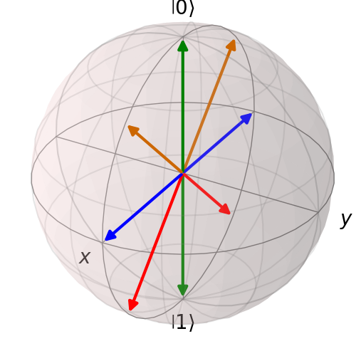
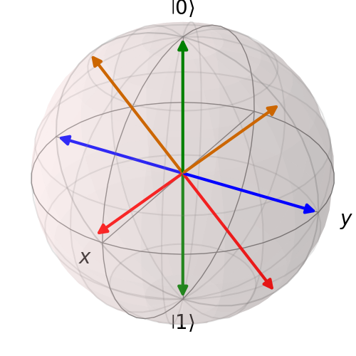

# BLOCH SPHERE ROTATIONS

Since I started in quantum computing, bloch sphere rotations were a big trouble to me. It was easy to get stuck, or simply don't understand what was happening.

So, today I decided to test some rotations and understand it better.

First of all, `Quirk` was a great deal to me. If you visit [Quirk's website](https://algassert.com/quirk), you'll see a bunch of stuff before you. However, the greatest feature of this simulator, is the gates explanation when you keep your mouse over each operator. In my case, looking at the explanation of `Z`, `X`, `H` and `Y` gates made all the difference to me.


The great thing about those descriptions are those tiny arrows pointing to the rotation direction. This way, was possible to understand how it works.

Altought the understanding was reached, I needed to test with some some. For that, I prepared a Qutip snippet a plot the vector onto a 3d Bloch Sphere (except the RZ rotations).




and finally, the RZ rotations only change the phase of a quantum state. Due to that, I only printed on terminal the resulting vectors:

```bash
angle: 0
state: [[1.+0.j]
 [0.+0.j]]

angle: 0.7853981633974483
state: [[0.92387953-0.38268343j]
 [0.        +0.j        ]]

angle: 1.5707963267948966
state: [[0.70710678-0.70710678j]
 [0.        +0.j        ]]

angle: 2.356194490192345
state: [[0.38268343-0.92387953j]
 [0.        +0.j        ]]

angle: 3.141592653589793
state: [[6.123234e-17-1.j]
 [0.000000e+00+0.j]]

angle: -0.7853981633974483
state: [[0.92387953+0.38268343j]
 [0.        +0.j        ]]

angle: -1.5707963267948966
state: [[0.70710678+0.70710678j]
 [0.        +0.j        ]]

angle: -2.356194490192345
state: [[0.38268343+0.92387953j]
 [0.        +0.j        ]]

```

## Rotations Summary

### RX

The RX rotation is the same as fixing the vector from the origin to the fartest point in the X axis, then rotating everything around by some angle.

### RY

The RY rotation is the same as fixing the vector from the origin to the fartest point in the Y axis, then rotating everything around by some angle.

### RZ

the RZ rotation is the only one we can see physically, once it only applies a phase to a state. So, in this case, no visible rotation is done. 

## Setup

For this experiment, you may start explore the Quirk simulator visting [algassert.com/quirk](https://algassert.com/quirk). Then, locally you need to install:

* python 3.10
* pip

install the dependencies:

```bash
pip install -r requirements.txt
```

after that, You're ready to run. 

```bash
python plots.py
```


