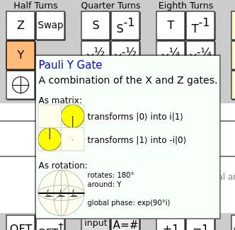
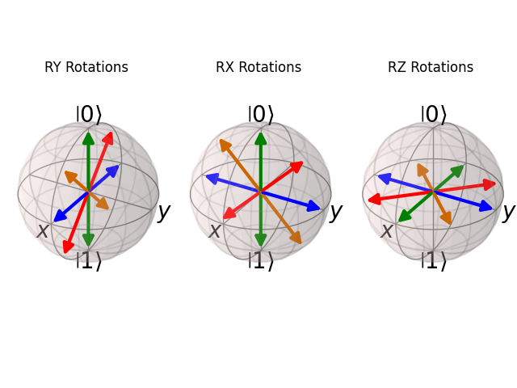

# BLOCH SPHERE ROTATIONS


https://github.com/user-attachments/assets/8e590dea-a3be-4980-ae6c-c86ab52ca006


Since I started in quantum computing, Bloch sphere rotations were a big trouble to me. It was easy to get stuck, or simply don't understand what was happening.

So, today I decided to test some rotations and understand it better.

First of all, `Quirk` was a great deal to me. If you visit [Quirk's website](https://algassert.com/quirk), you'll see a bunch of stuff before you. However, the greatest feature of this simulator, is the gates explanation when you keep your mouse over each operator. In my case, looking at the explanation of `Z`, `X`, `H` and `Y` gates made all the difference to me.




The great thing about those descriptions are those tiny arrows pointing to the rotation direction. This way, was possible to understand how it works.

Although the understanding was reached, I needed to test with some some. For that, I prepared a Qutip snippet a plot the vector onto a 3d Bloch Sphere.



## Rotations Summary

### RX

The RX rotation is the same as fixing the vector from the origin to the farthest point in the X axis, then rotating everything around by some angle.

### RY

The RY rotation is the same as fixing the vector from the origin to the farthest point in the Y axis, then rotating everything around by some angle.

### RZ

The RZ rotation works the same way as the others, however this time we need to use a initial state in half superposition to visualize the state transition, rotating the states in the horizontal axis unlike its counterparts.

## Setup

For this experiment, you may start explore the Quirk simulator visiting [algassert.com/quirk](https://algassert.com/quirk). Then, locally you need to install:

* python 3.10
* pip
* ffmpeg

install the dependencies:

```bash
pip install -r requirements.txt
```

after that, You're ready to run:

```bash
python plots.py

# and

python animate.py
```
